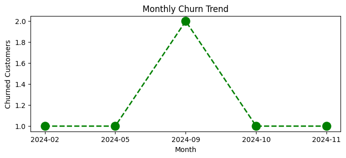
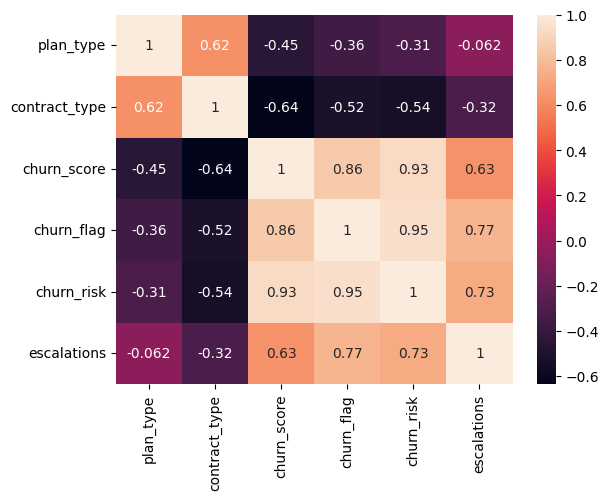

# 📊 Customer Churn Analysis using SQL & Python

## 📌 Project Overview

Customer churn is a key business metric for subscription-based companies, directly impacting revenue and customer retention. This project performs an end-to-end Exploratory Data Analysis (EDA) on customer subscription data to uncover churn patterns, identify high-risk customer segments, and generate actionable business insights.

The analysis includes data extraction from a SQLite database, data preprocessing, feature analysis, and visualizations built using Python libraries.

---

## 🎯 Objectives

- Extract customer data from a SQLite database using SQL.
- Clean and preprocess the dataset.
- Perform Exploratory Data Analysis (EDA).
- Analyze customer behavior and churn trends.
- Identify factors contributing to customer churn.
- Generate business recommendations based on data-driven insights.

---

## 🛠️ Tech Stack

| Category | Technologies |
|----------|--------------|
| Language | Python |
| Database | SQLite |
| Query Language | SQL |
| Libraries | Pandas, NumPy, Matplotlib, Seaborn |
| Environment | Jupyter Notebook |

---

## 📂 Repository Structure

```
Churn-Analysis/
│
├── data/
│   ├── customer_churn.db
│   ├── exported_churn_data.csv
│   └── test_database.sqlite
│
├── EDA/
│   └── churn_analysis.ipynb
│
├── README.md
└── .gitignore
```

---

## 📊 Dataset Information

The dataset contains customer subscription and support information, including:

- Customer ID
- Customer Name
- Country & State
- Gender
- Date of Birth
- Subscription Type
- Plan Type
- Contract Type
- Subscription Start Date
- Renewal Date
- Monthly Charges
- Customer Lifetime Value (CLTV)
- Churn Score
- Churn Status
- Cancellation Date & Reason
- Complaint Date
- Escalations
- CSAT Score
- Complaint Count

---

## 🔍 Exploratory Data Analysis

The notebook includes analysis of:

- Customer Churn Distribution
- Subscription Type Distribution
- Plan Type Analysis
- Contract Type Analysis
- Monthly Charges Distribution
- Customer Lifetime Value (CLTV)
- Churn Score Analysis
- Country-wise Customer Distribution
- State-wise Customer Distribution
- Gender-wise Customer Analysis
- Cancellation Reason Analysis
- Customer Complaint Analysis
- CSAT Score Distribution
- Escalation Analysis
- Correlation Heatmap
- Feature Relationships

---

## 📈 Key Performance Indicators (KPIs)

- Overall Churn Rate
- Retention Rate
- Average Monthly Charges
- Customer Lifetime Value (CLTV)
- Churn by Plan Type
- Churn by Contract Type
- Churn by Subscription Type
- Churn by State
- Complaint Count
- Customer Satisfaction (CSAT)
- Escalation Rate

---

## 💡 Key Insights

- Customers with **Monthly Contracts** are more likely to churn than customers with **Annual Contracts**.
- Customers having **higher churn scores** exhibit a greater probability of cancellation.
- Increased **complaints and support escalations** are associated with higher churn.
- Customers with **higher CLTV** should be prioritized for retention strategies.
- Cancellation reasons help identify areas where service quality and pricing can be improved.

---

## 📊 Visualizations

The analysis includes visualizations created using **Matplotlib** and **Seaborn**, such as:

- Count Plots
- Bar Charts
- Pie Charts
- Histograms
- Box Plots
- Correlation Heatmaps

---

## 📊 Sample Visualizations

### Monthly Churn Trend



### Correlation Heatmap



---

## 🚀 Getting Started

### Clone the Repository

```bash
git clone https://github.com/harshpatel-oss/customer-churn-analysis
```

### Navigate to the Project Directory

```bash
cd churn-analysis
```

### Install Required Libraries

```bash
pip install pandas numpy matplotlib seaborn jupyter
```

### Launch Jupyter Notebook

```bash
jupyter notebook
```

Open:

```
EDA/churn_analysis.ipynb
```

and run all cells.

---

## 📌 Future Enhancements

- Develop a Machine Learning model for churn prediction.
- Create an interactive Power BI dashboard.
- Build a Streamlit web application.
- Automate data extraction and reporting pipelines.

---

## 👨‍💻 Author

**Harsh Patel**

B.Tech, Electrical Engineering  
National Institute of Technology Raipur (NIT Raipur)

- GitHub: https://github.com/harshpatel-oss
- LinkedIn: https://www.linkedin.com/in/harshpatel1305/

---

## ⭐ Support

If you found this project helpful, consider giving the repository a **Star ⭐**.